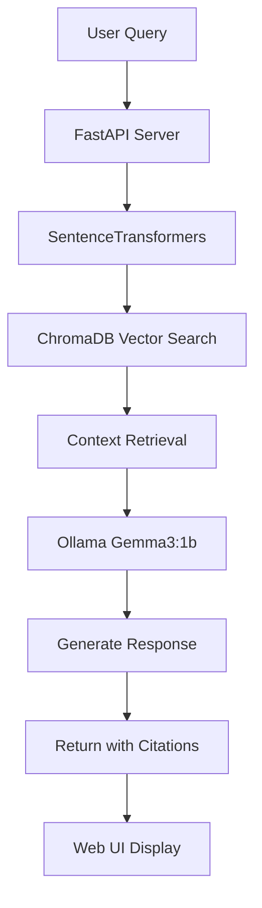

# Networking RAG System

Professional Q&A and Quiz system for networking topics using:

- **Retrieval**: HuggingFace SentenceTransformers (msmarco-distilbert-base-v4)
- **Vector Store**: ChromaDB
- **Generation**: Ollama with Gemma3:1b (local LLM)
- **API**: FastAPI with structured output
- **UI**: Modern chat interface

## 🚀 Quick Setup

### 1. Environment Setup

```bash
# Create virtual environment
python -m venv .rag

# Activate virtual environment
# On Windows:
.rag\Scripts\activate
# On Linux/Mac:
source .rag/bin/activate
```

### 2. Install Dependencies

```bash
pip install -r requirements.txt
```

### 3. Install Ollama

Download and install Ollama from [ollama.com](https://ollama.com/download)

### 4. Pull the Gemma3 Model

```bash
# Pull the Gemma3 1B model
ollama pull gemma3:1b

# Optional: Start Ollama service (runs automatically on first use)
ollama serve
```

### 5. Prepare Data & Build Vector Database

The system comes with pre-loaded networking PDFs. Build the vector database:

```bash
# Navigate to the embeddings directory
cd generate_embeddings

# Run the ingestion script
python ingest_hf.py
```

This will:

- Process PDFs from the `../pdfs/` directory
- Create embeddings using SentenceTransformers
- Store vectors in ChromaDB for fast retrieval

### 6. Configure Environment (Optional)

Create a `.env` file in the root directory:

```bash
# Ollama configuration (optional - defaults shown)
OLLAMA_HOST=http://localhost:11434
OLLAMA_MODEL=gemma3:1b
```

### 7. Run the Application

```bash
# Return to root directory
cd ..

# Start the FastAPI server
python main.py
```

### 8. Access the Web Interface

Open your browser and go to: **http://localhost:8000**

## 📋 System Requirements

- **Python**: 3.8+
- **Ollama**: Latest version
- **RAM**: 4GB+ recommended (for Gemma3:1b model)
- **Storage**: ~850MB for model + vector database

## 🔧 Key Files & Structure

```
├── main.py                 # FastAPI application entry point
├── api_qa.py              # Q&A mode with Ollama integration
├── api_quiz.py            # Quiz generation and checking
├── generate_embeddings/
│   ├── ingest_hf.py       # Build vector database from PDFs
│   └── query_hf.py        # Test embeddings (optional)
├── chroma_db/             # Vector database storage
├── pdfs/                  # Source PDF documents
├── static/                # Frontend assets (CSS/JS)
├── templates/             # HTML UI templates
├── requirements.txt       # Python dependencies
└── .env                   # Environment configuration
```

## 🎯 Features

### Q&A Mode

- Ask questions about networking topics
- Get contextual answers with citations
- Powered by local Gemma3:1b model
- Real-time response generation

### Quiz Mode

- Interactive quizzes with multiple question types
- 20 pre-configured networking topics
- Multiple choice, true/false, and open-ended questions
- Web citations for additional context
- Confidence-based grading system

## 📚 Available Topics

- Firewalls
- DNS (Domain Name System)
- TCP/IP Protocol
- Network Security
- Encryption and SSL/TLS
- VPN (Virtual Private Network)
- DDoS Attacks
- HTTP and HTTPS
- Network Routing
- OSI Model
- IP Addressing and Subnetting
- Network Authentication
- Wireless Security (WPA/WPA2)
- Intrusion Detection Systems (IDS)
- Load Balancing
- Network Protocols
- Packet Switching
- Network Topology
- Cybersecurity Threats
- Email Security (SMTP, POP3, IMAP)

## 🔍 Health Check

Check system status at: **http://localhost:8000/health**

Returns status of:

- Vector database connectivity
- Embedding model loading
- Ollama service availability

## 🛠 Troubleshooting

### Ollama Issues

```bash
# Check if Ollama is running
ollama list

# Stop running models
ollama stop gemma3:1b

# Restart Ollama service
ollama serve

# Check model availability
ollama show gemma3:1b
```

### Vector Database Issues

```bash
# Rebuild vector database
cd generate_embeddings
python ingest_hf.py
```

### Port Conflicts

If port 8000 is busy, modify the port in `main.py`:

```python
uvicorn.run("main:app", host="127.0.0.1", port=8001, reload=True)
```

## 🏗 Architecture



### Data Flow

1. **Query Processing**: User input → embedding → vector search
2. **Context Retrieval**: Top-K similar chunks from ChromaDB
3. **Generation**: Ollama processes context + query → coherent answer
4. **Response**: Structured output with citations and sources

## 📖 Usage Examples

### Q&A Examples

- "What is TCP/IP and how does it work?"
- "Explain the difference between HTTP and HTTPS"
- "How do firewalls protect networks?"
- "What are the main components of the OSI model?"

### Quiz Examples

- Multiple Choice: "What is the primary function of DNS?"
- True/False: "TCP guarantees delivery of packets"
- Open-Ended: "Explain how VPNs provide security"

## 🔧 Development

### Adding New PDFs

1. Place PDF files in the `pdfs/` directory
2. Run `python generate_embeddings/ingest_hf.py` to rebuild the database
3. Restart the application

### Customizing the Model

Edit `.env` file:

```bash
OLLAMA_MODEL=your-preferred-model
```

### Testing the Embeddings

```bash
cd generate_embeddings
python query_hf.py
```

## 📄 License

This project is open source. Feel free to modify and distribute.

---

**Ready to explore networking concepts with AI-powered assistance! 🤖📡**
